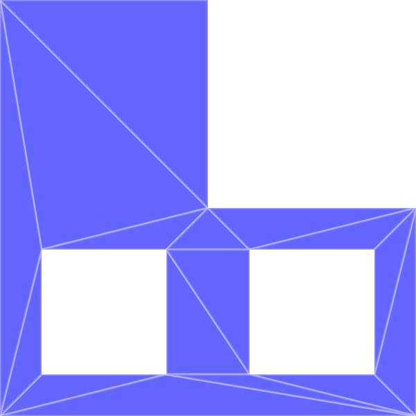
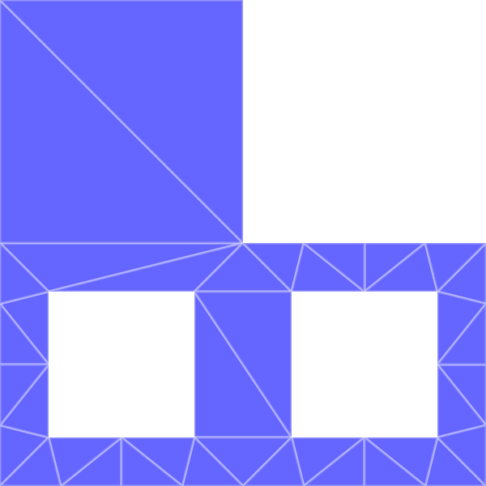
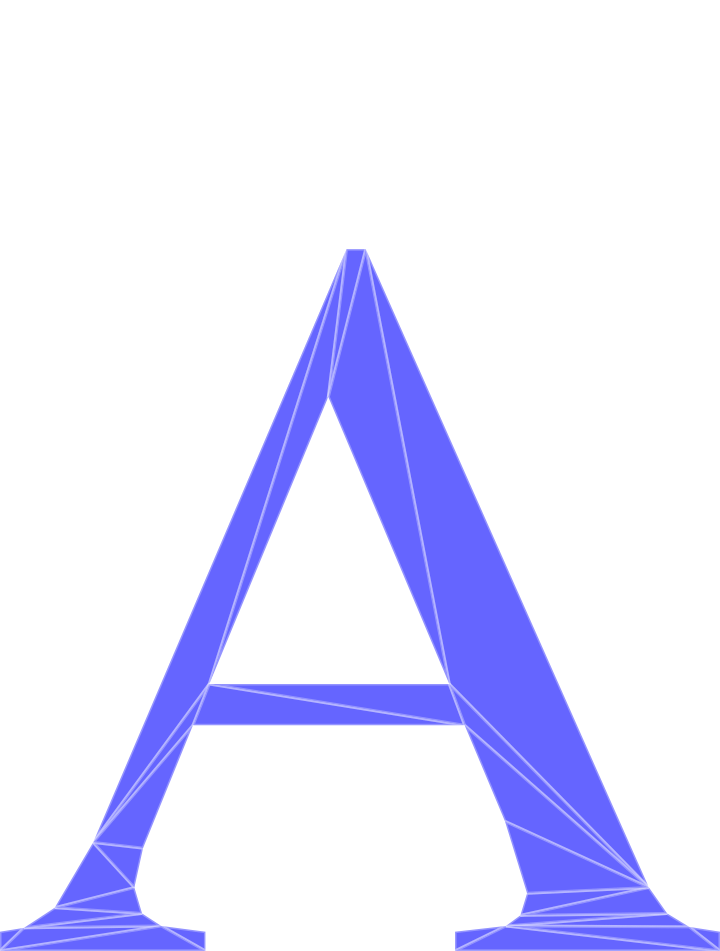
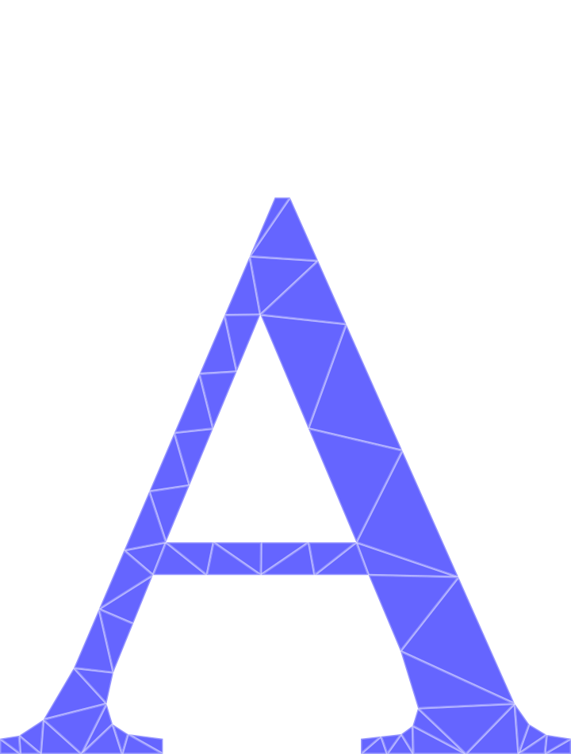

# Swift wrapper for triangle

This package is a wrapper for the [Triangle library](https://www.cs.cmu.edu/~quake/triangle.html) originally written in C by Jonathan Shewchuk, and heavily inspired by the [golang port](https://github.com/pradeep-pyro/triangle).

Features:
 - constrained & conforming Delaunay triangulation (with support for holes)
 <!-- - triangle mesh generation with area and angle constraints -->

for points in 2D.


## Usage

### Delaunay triangulation of points

The Delaunay function takes a slice of 2D points represented as `[CGPoint]`.

```swift
let points = [
    CGPoint(x: 0, y: 0),
    CGPoint(x: 10, y: 0),
    CGPoint(x: 10, y: 10),
    CGPoint(x: 0, y: 10)
]
```

`Triangulate.Delaunay(points: )` returns an array of Triangles` (left image below).
``` swift
let triangles = Triangulate.Delaunay(points: points)
dump(triangles)
// ▿ 2 elements
//  ▿ Triangle.Triangle #0
//    ▿ a: (0.0, 10.0)
//    ▿ b: (0.0, 0.0)
//    ▿ c: (10.0, 0.0)
//  ▿ Triangle.Triangle #1
//    ▿ a: (10.0, 0.0)
//    ▿ b: (10.0, 10.0)
//    ▿ c: (0.0, 10.0)
```

### Constrained and conforming Delaunay triangulation of PSLGs

Functions ConformingDelaunay() and ConstrainedDelaunay() accept a PSLG as input. PSLGs are planar straight line graphs defined by a set of points ([][2]float64), segments (pair of indices into the points slice [][2]int32), and holes ( single point somewhere within each hole [][2]float64).

```swift
// Points forming the shape of letter "A"

        var points = [
            0.200000, -0.776400,
            0.220000, -0.773200,
            0.245600, -0.756400,
            0.277600, -0.702000,
            0.488800, -0.207600,
            0.504800, -0.207600,
            0.740800, -0.7396,
            0.756000, -0.761200,
            0.774400, -0.7724,
            0.800000, -0.776400,
            0.800000, -0.792400,
            0.579200, -0.792400,
            0.579200, -0.776400,
            0.621600, -0.771600,
            0.633600, -0.762800,
            0.639200, -0.744400,
            0.620800, -0.684400,
            0.587200, -0.604400,
            0.360800, -0.604400,
            0.319200, -0.706800,
            0.312000, -0.739600,
            0.318400, -0.761200,
            0.334400, -0.771600,
            0.371200, -0.776400,
            0.371200, -0.792400,
            0.374400, -0.570000,
            0.574400, -0.5700,
            0.473600, -0.330800,
            0.200000, -0.792400
        ]

        var segments = [
            28, 0,
            0, 1,
            1, 2,
            2, 3,
            3, 4,
            4, 5,
            5, 6,
            6, 7,
            7, 8,
            8, 9,
            9, 10,
            10, 11,
            11, 12,
            12, 13,
            13, 14,
            14, 15,
            15, 16,
            16, 17,
            17, 18,
            18, 19,
            19, 20,
            20, 21,
            21, 22,
            22, 23,
            23, 24,
            24, 28,
            25, 26,
            26, 27,
            27, 25
        ]

        var holes = [
            0.47, -0.5,
        ]

var pts = [][2]float64{{0.200000, -0.776400}, {0.220000, -0.773200},
    {0.245600, -0.756400}, {0.277600, -0.702000}, {0.488800, -0.207600}, {0.504800, -0.207600}, {0.740800, -0.7396}, {0.756000, -0.761200},
    {0.774400, -0.7724}, {0.800000, -0.776400}, {0.800000, -0.792400}, {0.579200, -0.792400}, {0.579200, -0.776400}, {0.621600, -0.771600},
    {0.633600, -0.762800}, {0.639200, -0.744400}, {0.620800, -0.684400}, {0.587200, -0.604400}, {0.360800, -0.604400}, {0.319200, -0.706800},
    {0.312000, -0.739600}, {0.318400, -0.761200}, {0.334400, -0.771600}, {0.371200, -0.776400}, {0.371200, -0.792400}, {0.374400, -0.570000},
    {0.574400, -0.5700}, {0.473600, -0.330800}, {0.200000, -0.792400},
}
// Segments connecting the points
var segs = [][2]int32{{28, 0}, {0, 1}, {1, 2}, {2, 3}, {3, 4}, {4, 5}, {5, 6}, {6, 7}, {7, 8}, {8, 9}, {9, 10}, {10, 11}, {11, 12}, {12, 13}, {13, 14}, {14, 15}, {15, 16}, {16, 17}, {17, 18}, {18, 19}, {19, 20}, {20, 21}, {21, 22}, {22, 23}, {23, 24}, {24, 28}, {25, 26}, {26, 27}, {27, 25},
}
// Hole represented by a point lying inside it 
var holes = [][2]float64{
    {0.47, -0.5},
}


```

`ConstrainedDelaunay()` computes a constrained Delaunay triangulation of a PSLG, where the given segments are retained as such in the resulting triangulation. As a result, not all triangles are Delaunay. (left image below)
```swift
let (points, triangleIndicies) = Triangulate.ConstrainedDelaunay(points: points, segments: segments, holes: holes)
```

`ConformingDelaunay()` computes a conforming Delaunay triangulation of a PSLG, where each triangle in the result is Delaunay. This is acheived by inserting vertices inbetween the given segments. (right image below)
```swift
let (points, triangleIndicies) = Triangulate.ConformingDelaunay(points: points, segments: segments, holes: holes)
```

| Constrained Delaunay | Conforming Delaunay |
| :---: | :---: |
|  |  |

| Constrained Delaunay | Conforming Delaunay |
| :---: | :---: |
|  |  |
